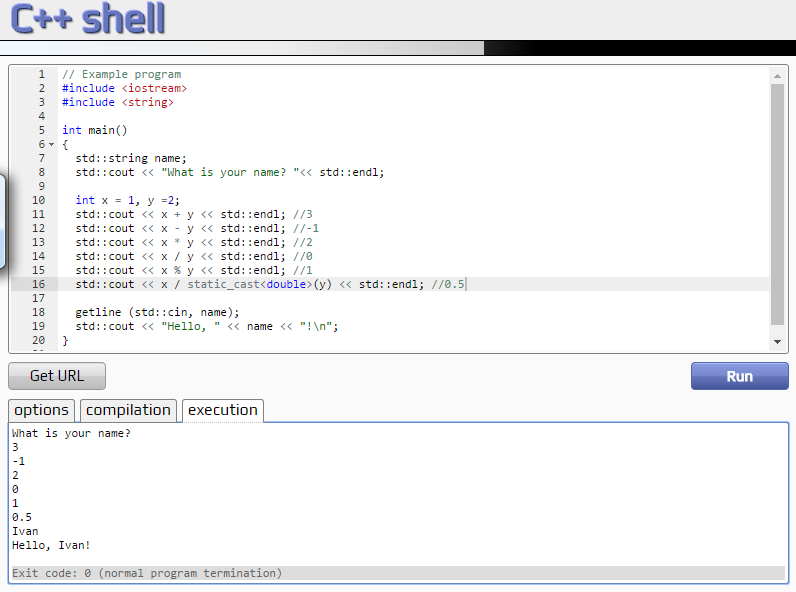

# Операции в C++
 - Потърсете описание на операторите и примери за употребата им (C++ operators)
 
Пример: Основните аритметични операции, разписани в [http://cpp.sh](http://cpp.sh)

# Цикли в C++
 - Създайте plot_04_loops.cpp
 - Задайте равни ширина и височина на генерираното SVG изображение. Например `<svg width="200" height="200">`
 - Нарисувайте по продължението на двата диагонала жълти кръгчета с радиус 5, с отместване 20 по абсцисата
 - Променете кода така че цветовете на кръгчетата да се редуват - red, green, blue, yellow
